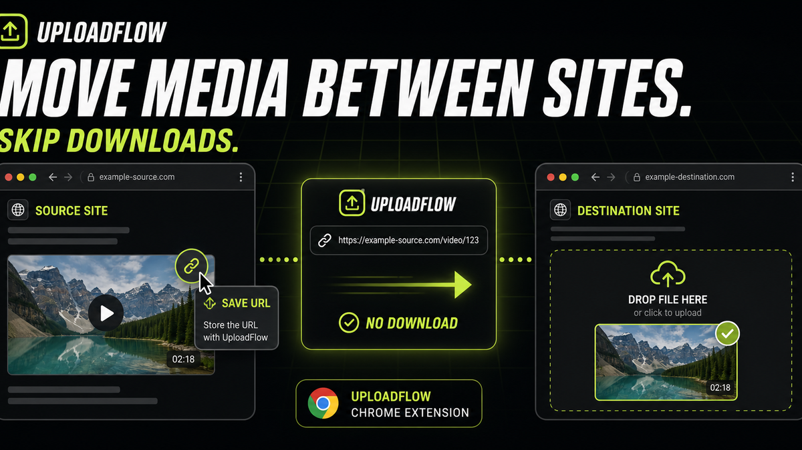
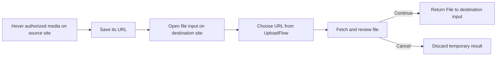

# UploadFlow


UploadFlow is a Chrome extension for moving media you are authorized to use from one webpage into another website’s upload flow without downloading it first. Capture the media URL, open the destination file input, review the fetched file, and send it directly into that upload.

UploadFlow is developed and maintained by [CloudGrids](https://cloudgrids.tech/), a publisher of privacy-conscious browser tools and web applications.

UploadFlow stores the URL rather than a permanent copy of the source file. It fetches the media only when a destination website requests a file. Everything except URL retrieval and optional AI upscaling runs locally.

[Visit UploadFlow](https://uploadflow.cloudgrids.tech) · [Watch the vertical demo](public/media/uploadflow-social-vertical.mp4)

## Preview



The visual shows the primary flow: save an authorized media URL on a source webpage, open a different website, and supply the fetched file directly to its upload input without first saving it to the Downloads folder.


## Features

- Captures authorized webpage image, video, and audio URLs through an optional hover control.
- Keeps up to 20 media URLs with previews for use on another website.
- Fetches the selected URL only when a destination file input requests it.
- Intercepts file inputs, drag and drop, paste, and supported page API uploads.
- Optimizes and converts PNG, JPEG, and WebP images before upload.
- Redacts email addresses, phone numbers, payment-card numbers, and IP addresses.
- Adds configurable text watermarks with a live preview.
- Upscales images through the UploadFlow API when enabled.
- Hands downloads to Chrome so progress and completed transfers remain visible in the browser.
- Offers either the native file picker or an UploadFlow URL picker.
- Stores settings and statistics in Chrome extension storage.

## How it works



UploadFlow keeps the source URL until another website asks for a file. It then fetches the media, creates a browser `File`, opens the review workspace, and supplies the approved result to the destination input. It does not bypass authentication, paywalls, access controls, or usage rights.

## Install locally

Requirements: Node.js 20 or newer, npm, and a Chromium-based browser.

```bash
pnpm install
pnpm dev
```

## Development

```bash
pnpm dev       # start the public Next.js app
pnpm build     # build the Next.js website
pnpm lint      # run ESLint
pnpm preview   # preview the production build
```

The Next.js development server provides both the landing and test routes. This public repository contains no Chrome extension source.

Vercel can deploy this directory directly; `vercel.json`, API routes, and the production build are self-contained.

## Project structure

```text
src/app/                App Router pages, layouts, and route handlers
public/                 screenshots, social media, and site assets
src/components/         landing-page components
src/test/               browser upload test page
src/utils/              public website helpers
```

## Permissions

UploadFlow uses these Manifest V3 permissions:

- `storage` — save settings and local statistics.
- `downloads` — create browser-managed downloads.
- `scripting` and `activeTab` — connect extension behavior to the current page.
- `http://*/*` and `https://*/*` host access — detect upload targets and retrieve user-selected URL files where the remote server permits access.

Some protected, expiring, authenticated, or hotlink-blocked media URLs can still return `403`. UploadFlow does not bypass a website's authentication or access controls.

## Privacy

Image optimization, redaction, and watermarking happen on the device. UploadFlow does not use a cloud drive as an intermediary. Network access is required for URL imports and optional upscaling, and those operations remain subject to the source site's access policy.

## Social assets

- [Open Graph image](public/og-image.png)
- [Landscape share preview](public/share-preview.png)
- [Cross-site handoff master](public/uploadflow-cross-site-master.png)
- [Vertical video poster](public/media/uploadflow-social-poster.jpg)
- [Vertical social video](public/media/uploadflow-social-vertical.mp4)
- [Storyboard](public/social/storyboard-contact-sheet.png)
