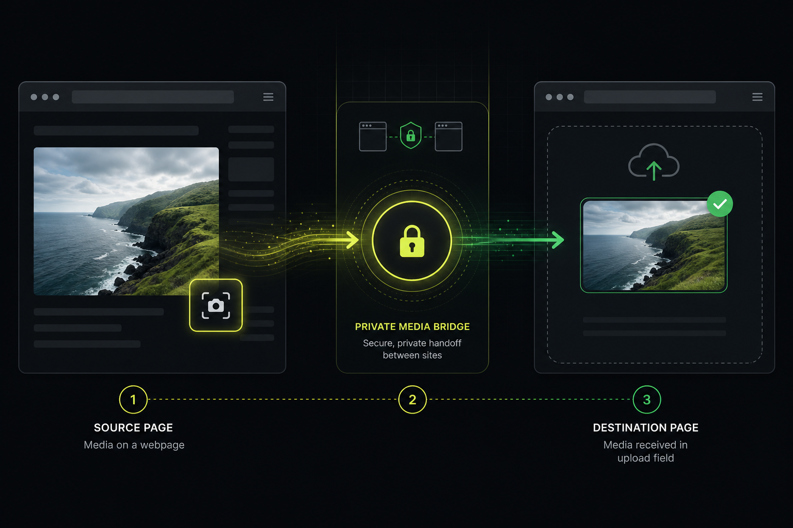
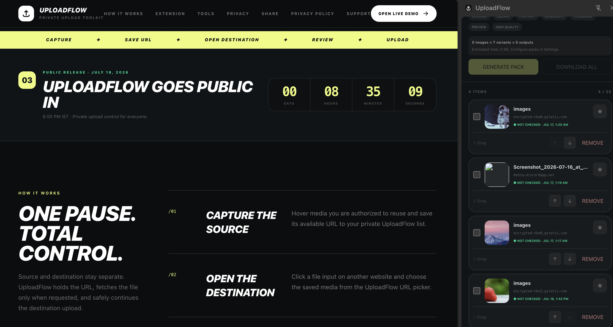
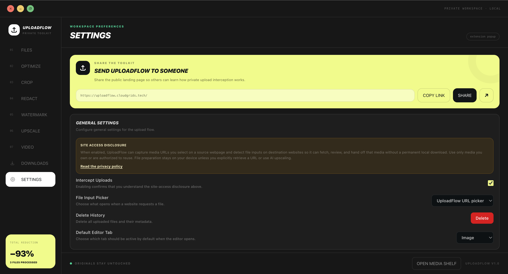
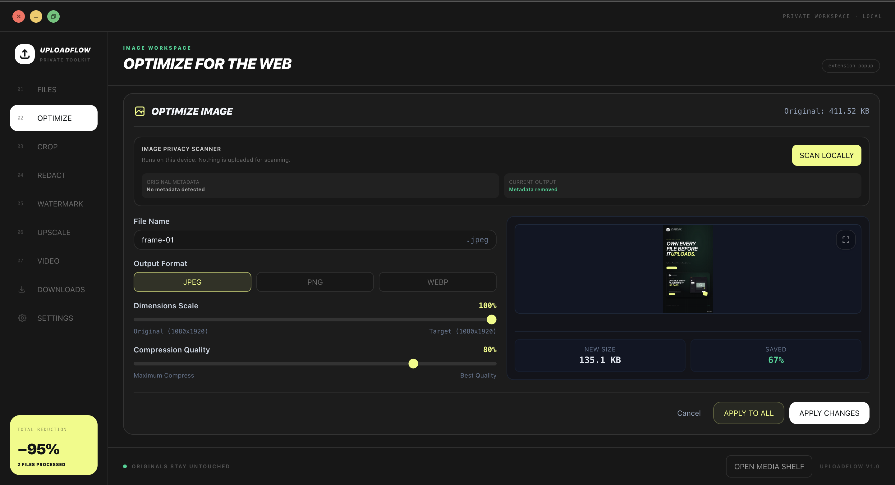
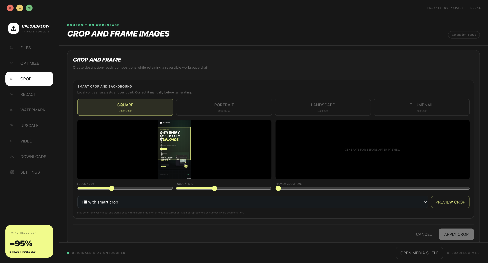
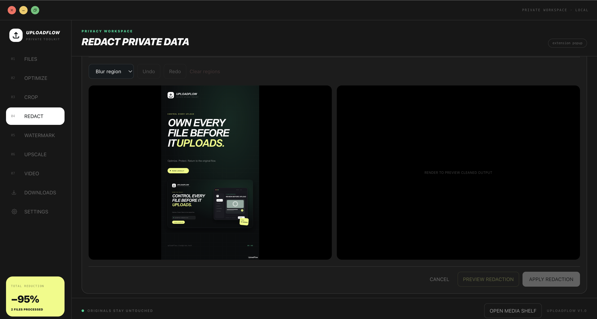
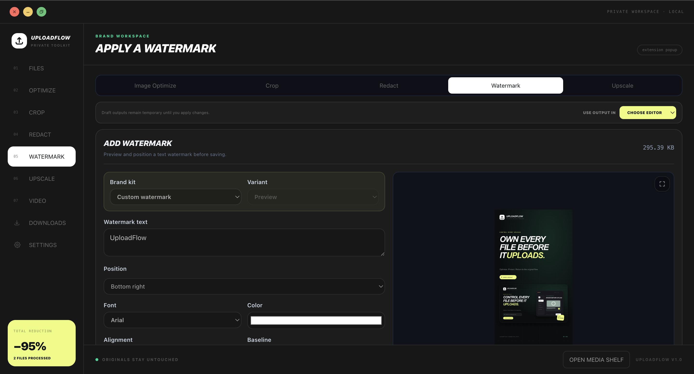
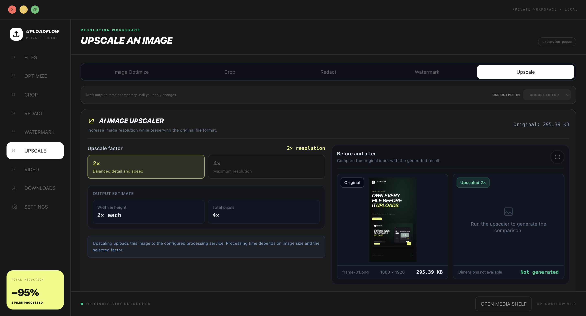
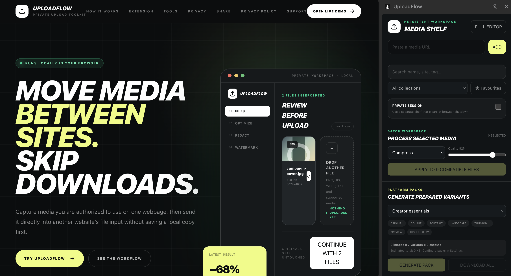
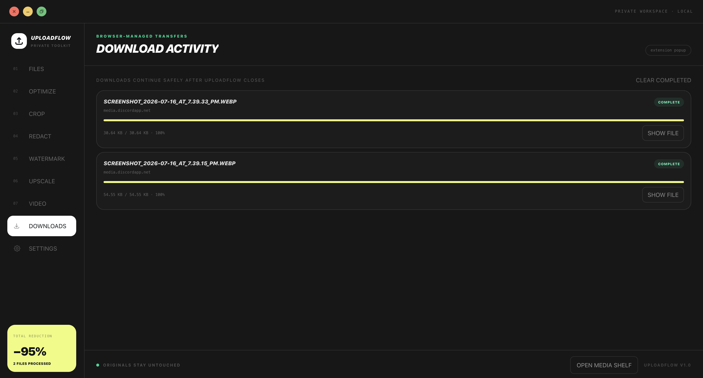

# UploadFlow

> **Never download it. Never lose it.**

[UploadFlow](https://uploadflow.cloudgrids.tech) is the browser’s missing media layer: move, prepare, track, and find media across the web without managing folders or filenames.

The current pre-release extension moves media you own or are authorized to reuse from one website into another website’s upload flow without first saving a permanent Downloads copy. Its development build now connects a source, its prepared versions, and the destinations a user explicitly records.

It brings capture, organization, preparation, review, and upload handoff into one private browser workspace. UploadFlow does not bypass authentication, paywalls, expiring signatures, hotlink protection, access controls, or usage rights.

## The product model

UploadFlow should feel simple: **it remembers your media so you do not have to.** It is not a cloud drive or a traditional digital asset manager.

1. **Capture.** Know where authorized media came from.
2. **Transform.** Connect edits, crops, compression, watermarks, redactions, and generated versions.
3. **Deliver.** Remember destinations the user explicitly confirms.
4. **Recall.** Find media by source, date, destination, description, or local visual similarity.
5. **Protect.** Keep the history local, bounded, user-controlled, exportable, and easy to erase.

Capture and cross-site delivery work in the current pre-release build. Post Bundles, Site presets, local lineage, recall, visual similarity, destination history, workflow reuse, retention, export, and deletion are **in beta and awaiting manual release verification**.

- **Handoff — Early Access:** secure pairing groundwork is available; live encrypted file transfer is still being completed.
- **Live Draft Sync — Experimental:** disabled by default and intended only for supported upload flows before uploading starts. Some sites do not expose upload state reliably; unsupported sites ask the user to replace a newer attachment manually.

## How UploadFlow works

1. **Capture the source.** Hover or right-click supported media, use Inspect Mode, or paste a direct HTTP/HTTPS media URL.
2. **Save the reference.** UploadFlow keeps a bounded URL reference in the local media shelf instead of silently downloading every file.
3. **Prepare the media.** Optimize, crop, redact, watermark, upscale, batch-process, or trim supported files before upload.
4. **Open the destination.** Click a file input on another website and select the saved media through the UploadFlow picker.
5. **Review and hand off.** UploadFlow fetches the source when requested, checks compatibility, and returns the approved `File` to the original upload flow.

## Complete posts and repeatable destinations

### Post Bundles

Post Bundles keep a complete user-approved content package together instead of treating every file as unrelated media. Capture a supported post or build a bundle from selected Media Shelf items, then review:

- Ordered images and videos
- Title and caption
- Attribution and links
- Hashtags
- Cover and video-cover relationships
- Per-media alt text

When a compatible destination requests files, UploadFlow can insert the available bundle media in its saved order. Unsupported text fields remain available for manual copy rather than being silently discarded.

### Site presets

Site presets describe repeatable rules for a destination hostname or wildcard hostname pattern. A preset can configure:

- File-count limits and filename templates
- Image transforms, dimensions, format, and quality
- Optional Brand Kit and watermark choices
- Post Bundle title, body, link, and hashtag field selectors

A Site preset prepares and fills a destination draft only after an explicit UploadFlow action. It never submits, schedules, purchases, or publishes the website form.

### Connected pending drafts

When explicitly enabled, experimental Live Draft Sync tracks only files that UploadFlow placed into supported, currently connected, unsubmitted upload inputs before uploading starts. The side panel distinguishes these as pending local attachments. A user can select one corrected file, review every matching destination, and explicitly confirm which open drafts should receive it.

Immediately before replacement, UploadFlow verifies the exact file identity again. Each destination reports success or failure independently, and the previous local attachment remains available for rollback while that receiver stays connected. Submitted, reloaded, disconnected, changed, identity-mismatched, and unsupported inputs are excluded. Do not use replacement after an upload starts: websites do not always expose that state to extensions. Unsupported sites show that a newer version is available and require manual replacement.

## One workspace, three surfaces

### Quick popup

Capture a URL, inspect recent media, enable or disable interception, and move directly into the appropriate editor.

### Persistent media shelf

The Chrome side panel keeps authorized media references available while moving between tabs. Its tabs provide the Media Shelf, Post Bundles, Handoff foundation, and connected pending drafts. Search, tag, favourite, collect, reorder, select, batch-process, and prepare destination-specific variants.

### Full preparation editor

The full workspace provides focused editors while preserving the original file. A completed output can be passed into any compatible editor before it is handed to a destination website.

## Preparation tools

### Optimize

Resize, compress, rename, convert between supported image formats, inspect metadata, and export a clean upload-ready image.

### Crop and compose

Create square, portrait, landscape, and thumbnail compositions with adjustable focus and preview controls.

### Redact private regions

Blur or cover selected regions, review the cleaned preview, and apply the result only after confirming the before-and-after view.

### Apply watermarks and brand kits

Reuse text or saved brand variants with configurable position, font, colour, alignment, and baseline.

### Upscale images

Choose a supported enlargement factor, review estimated output dimensions, and compare the generated result with the original. Upscaling is an explicit network action.

### Prepare video

Trim MP4 files through fast stream copying when no transformation is needed. Crop, resize, speed, bitrate, audio, and format changes use the locally packaged FFmpeg Wasm renderer. Cover frames can be selected independently.

### Batch and platform packs

Process compatible selected media through a bounded queue, generate reusable destination variants, and download completed outputs together as a ZIP.

### Browser-managed downloads

Explicit downloads are handed to Chrome so progress and saving continue safely after UploadFlow closes.

## Privacy and permissions

Image preparation, metadata review, redaction, cropping, watermarking, fingerprint calculation, Post Bundle assembly, ZIP assembly, batches, platform packs, and FFmpeg Wasm video processing run locally in the extension.

Network access occurs only when the user explicitly retrieves a saved source URL, starts an explicit download, or invokes optional AI upscaling. Private Media Memory is optional, bounded by the selected 7, 30, or 90-day retention period, exportable, and user-deletable. It records explicit captures, transformations, versions, and deliveries—not general browsing activity.

Post Bundles store only the media references and text fields the user approves. Site presets store hostname rules, preparation choices, and optional field selectors; they do not continuously copy values from websites. Live Draft Sync keeps connected-input identity records in session storage and keeps corrected or rollback file bytes only in active extension memory. Its records do not mean that content was published.

The extension requests website access to detect upload inputs, provide user-triggered media inspection, capture explicitly approved Post Bundle fields, apply configured Site preset selectors, and verify confirmed pending-draft replacements across source and destination websites. Storage keeps extension preferences, bounded shelf and bundle records, presets, and optional Media Memory metadata. Downloads lets explicit saves continue through Chrome. Side Panel provides the persistent workspaces.

Read the complete [privacy policy](https://uploadflow.cloudgrids.tech/privacy).

## Compatibility boundaries

- Direct public HTTP and HTTPS media URLs work best.
- Signed or temporary URLs stop working after their source-defined expiry.
- Authenticated, protected, hotlink-blocked, blob, or streamed media might not be retrievable.
- Fast video trimming is available for compatible MP4 streams; transformations require local re-encoding.
- UploadFlow never grants permission to reuse media and does not circumvent source restrictions.

## Publishing and public resources

UploadFlow is developed and published by [CloudGrids](https://cloudgrids.tech/) under the publisher name **CLOUDGRIDS TECH**.

- [Official website](https://uploadflow.cloudgrids.tech/)
- [Detailed product guide](https://uploadflow.cloudgrids.tech/how-it-works)
- [Live demonstration](https://uploadflow.cloudgrids.tech/demo)
- [Privacy policy](https://uploadflow.cloudgrids.tech/privacy)
- [Support](https://uploadflow.cloudgrids.tech/support)
- [Report an issue or request a feature](https://github.com/cloudgrids/uploadflow/issues/new/choose)

Public listing and social assets are maintained in [`public/`](public/), including the Open Graph image, share preview, screenshots, workflow diagrams, posters, and demonstration video.
