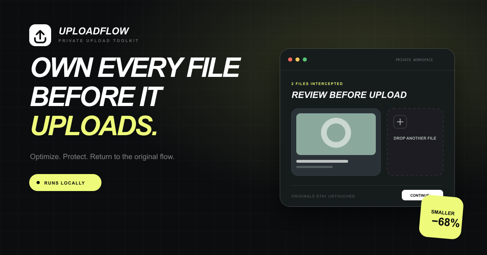
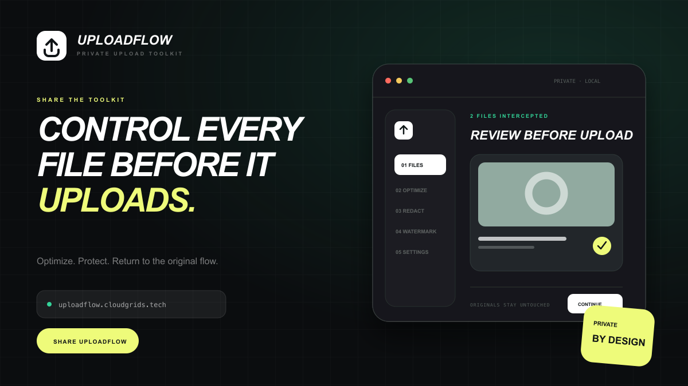
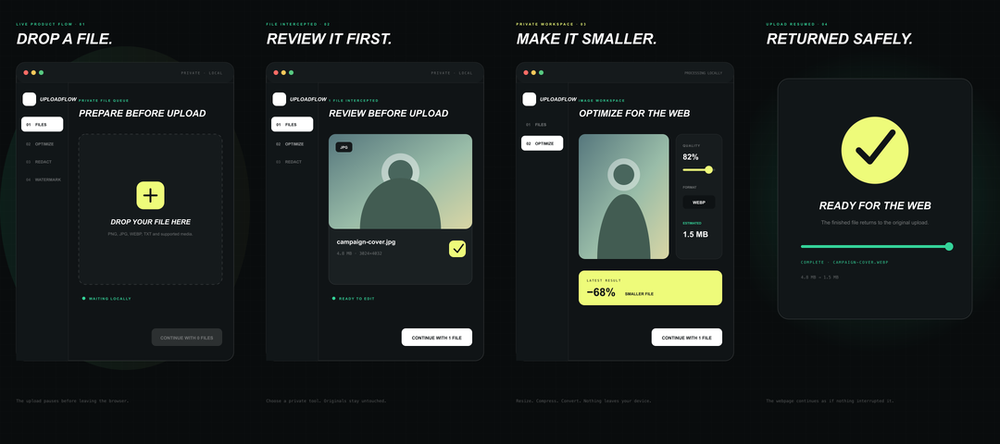
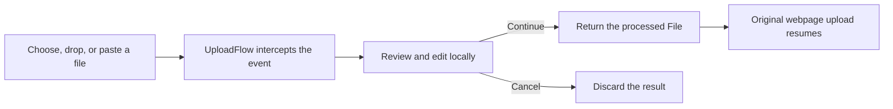

# UploadFlow



UploadFlow is a Chrome extension that intercepts files before they leave the browser. Review, optimize, redact, watermark, or upscale a file in a private workspace, then return the finished file to the webpage that requested it.

Everything except optional AI upscaling runs locally. Original files remain untouched until you approve the result.

[Visit UploadFlow](https://uploadflow.cloudgrids.tech) · [Watch the vertical demo](apps/web/public/media/uploadflow-social-vertical.mp4)

## Preview

[](apps/web/public/media/uploadflow-social-vertical.mp4)

The demo follows the complete flow: intercept a file, review it in the workspace, apply an edit, and return it to the original page. Select the image above to play the MP4.



## Features

- Intercepts file inputs, drag and drop, paste, and supported page API uploads.
- Optimizes and converts PNG, JPEG, and WebP images before upload.
- Redacts email addresses, phone numbers, payment-card numbers, and IP addresses.
- Adds configurable text watermarks with a live preview.
- Upscales images through the UploadFlow API when enabled.
- Detects webpage images, video, and audio through an optional media inspector.
- Hands downloads to Chrome so progress and completed transfers remain visible in the browser.
- Offers either the native file picker or an UploadFlow URL picker.
- Stores settings and statistics in Chrome extension storage.

## How it works



UploadFlow listens before the website receives the file event. When you continue, it supplies the processed `File` back to the original input or page API. Cancelling closes the workspace without uploading the edited result.

## Install locally

Requirements: Node.js 20 or newer, npm, and a Chromium-based browser.

```bash
npm install
npm run build
```

Then install the generated extension:

1. Open `chrome://extensions`.
2. Enable **Developer mode**.
3. Select **Load unpacked**.
4. Choose this project's `apps/extension/dist` directory.
5. Pin UploadFlow and enable upload interception from its popup.

After rebuilding, select **Reload** on the extension card. Existing tabs may also need to be refreshed because their old content-script context is no longer valid.

## Development

```bash
npm run dev              # start the public Vite web app
npm run build            # build both workspace applications
npm run build:web        # build only the landing and test website
npm run build:extension  # build only the Chrome extension
npm run lint      # run ESLint
npm run preview   # preview the production web build
```

The local Vite page is useful for the landing and test routes. Chrome runs the production extension from `dist`; it does not depend on the Vite development server after `npm run build`.

For Vercel, set the project **Root Directory** to `apps/web`. Its `vercel.json`, API routes, and production output are contained inside that workspace. The extension source is not included in the website bundle.

## Project structure

```text
apps/web/               public landing page, test page, social assets, and APIs
apps/extension/         Chrome popup, manifest, background, and interception code
  src/background/       service worker, downloads, and URL file fetching
  src/content/          DOM interception, overlay, media inspector, URL picker
  src/main-world/       wrappers that run in the webpage's JavaScript world
  src/components/       workspace, editors, and downloads UI
  src/settings/         extension settings panels and models
  src/services/         storage, configuration, statistics, and API clients
```

## Permissions

UploadFlow uses these Manifest V3 permissions:

- `storage` — save settings and local statistics.
- `downloads` — create browser-managed downloads.
- `scripting` and `activeTab` — connect extension behavior to the current page.
- `http://*/*` and `https://*/*` host access — detect upload targets and retrieve user-selected URL files where the remote server permits access.

Some protected, expiring, authenticated, or hotlink-blocked media URLs can still return `403`. UploadFlow does not bypass a website's authentication or access controls.

## Privacy

Image optimization, redaction, and watermarking happen on the device. UploadFlow does not use a cloud drive as an intermediary. Network access is required for URL imports and optional upscaling, and those operations remain subject to the source site's access policy.

## Social assets

- [Open Graph image](apps/web/public/og-image.png)
- [Landscape share preview](apps/web/public/share-preview.png)
- [Vertical video poster](apps/web/public/media/uploadflow-social-poster.jpg)
- [Vertical social video](apps/web/public/media/uploadflow-social-vertical.mp4)
- [Storyboard](apps/web/public/social/storyboard-contact-sheet.png)
