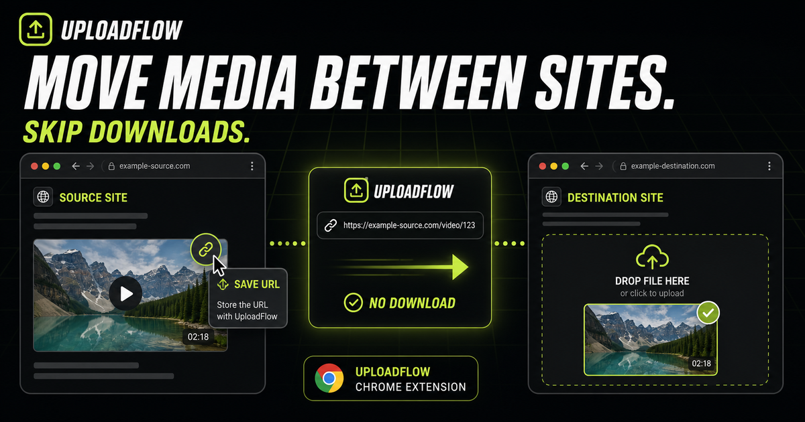

# UploadFlow Website



The public Next.js website for [UploadFlow](https://uploadflow.cloudgrids.tech), a local-first Chrome extension for capturing media users own or are authorized to reuse, preparing it in a private workspace, and supplying it to another website’s file input.

This repository contains the website, public documentation, privacy and support pages, upload-interception demo, and social assets. The Chrome extension source is maintained separately in a private repository.

Report public issues in [cloudgrids/uploadflow](https://github.com/cloudgrids/uploadflow/issues).

## Product overview

UploadFlow connects three surfaces around one local media shelf:

- A small popup for quick capture, recent items, enablement, and navigation.
- A persistent side panel for shelf organization, batches, platform packs, and queue status across tabs.
- A full editor for image optimization, crop/background work, privacy review and redaction, watermark/brand-kit application, upscaling, and supported browser-native video editing.

The primary handoff remains simple: capture an authorized source URL, prepare it if needed, open a destination input, fetch the source on demand, review compatibility, and return the approved `File` to the destination page. UploadFlow does not bypass authentication, paywalls, expiring signatures, hotlink protection, or usage rights.

## Website routes

- `/` — product landing page
- `/how-it-works` — detailed capture, preparation, privacy, batch, video, and handoff guide
- `/demo` — upload-interception test and product demonstration
- `/privacy` — public privacy policy
- `/support` — support and compatibility guidance
- `/api/upscale` — disclosed optional upscaling API route

## Development

Requirements: Node.js 20+, pnpm, and a modern browser.

```bash
pnpm install
pnpm dev
```

```bash
pnpm lint
pnpm build
pnpm start
```

The website uses Next.js App Router and Tailwind CSS. Configure the deployment root to this `web/` directory so the platform detects the local `next` dependency and `package.json`.

## Structure

```text
src/app/                 App Router pages, metadata, policies, and API routes
src/components/          Public page composition
src/components/landing/ Landing content and reusable visual modules
src/test/                Modular upload-interception demo
src/utils/               Public sharing and small browser helpers
public/                  Verification file, screenshots, video, and social assets
```

## Privacy boundary

Local image transforms, privacy review, crop/background work, watermarks, batch/platform-pack work, duplicate fingerprints, and supported video editing run in the extension. Network access occurs when the user explicitly retrieves a source URL or invokes optional AI upscaling. Optional private workflow history is disabled by default, bounded, retained for the selected period, and user-deletable.

See the live [privacy policy](https://uploadflow.cloudgrids.tech/privacy) for the public disclosure that governs the published extension.

## Public assets

- [Open Graph image](public/og-image.png)
- [Landscape share preview](public/share-preview.png)
- [Cross-site handoff diagram](public/uploadflow-cross-site-master.png)
- [Cross-site feature illustration](public/features/cross-site-handoff.png)
- [Actual product overview with workspace and shelf](public/features/product-overview-actual.png)
- [Actual populated media shelf](public/features/media-shelf-actual.png)
- [Actual batch and platform-pack controls](public/features/batch-packs-actual.png)
- [Actual full workspace settings](public/features/workspace-settings-actual.png)
- [Actual Optimize workspace](public/features/optimize-actual.png)
- [Actual Crop workspace](public/features/crop-actual.png)
- [Actual Redact workspace](public/features/redact-actual.png)
- [Actual Watermark workspace](public/features/watermark-actual.png)
- [Actual Upscale workspace](public/features/upscale-actual.png)
- [Actual Downloads workspace](public/features/downloads-actual.png)
- [Coming-soon editor concept](public/features/editor-workspace.png)
- [Vertical demo video](public/media/uploadflow-social-vertical.mp4)
- [Vertical video poster](public/media/uploadflow-social-poster.jpg)
- [Demo contact sheet](public/social/demo-contact-sheet.png)

UploadFlow is developed and published by [CloudGrids](https://cloudgrids.tech/).
