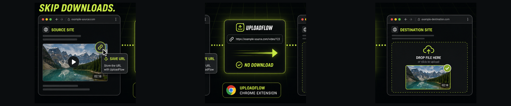
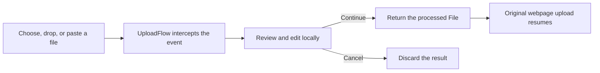

# UploadFlow


UploadFlow is a Chrome extension that intercepts files before they leave the browser. Review, optimize, redact, watermark, or upscale a file in a private workspace, then return the finished file to the webpage that requested it.

Everything except optional AI upscaling runs locally. Original files remain untouched until you approve the result.

[Visit UploadFlow](https://uploadflow.cloudgrids.tech) · [Watch the vertical demo](public/media/uploadflow-social-vertical.mp4)

## Preview

[](public/media/uploadflow-social-vertical.mp4)

The demo follows the complete flow: intercept a file, review it in the workspace, apply an edit, and return it to the original page. Select the image above to play the MP4.



## Features

- Intercepts file inputs, drag and drop, paste, and supported page API uploads.
- Optimizes and converts PNG, JPEG, and WebP images before upload.
- Redacts email addresses, phone numbers, payment-card numbers, and IP addresses.
- Adds configurable text watermarks with a live preview.
- Upscales images through the UploadFlow API when enabled.
- Detects webpage images, video, and audio through an optional media inspector.
- Hands downloads to Chrome so progress and completed transfers remain visible in the browser.
- Offers either the native file picker or an UploadFlow URL picker.
- Stores settings and statistics in Chrome extension storage.

## How it works



UploadFlow listens before the website receives the file event. When you continue, it supplies the processed `File` back to the original input or page API. Cancelling closes the workspace without uploading the edited result.

## Install locally

Requirements: Node.js 20 or newer, npm, and a Chromium-based browser.

```bash
pnpm install
pnpm dev
```

## Development

```bash
pnpm dev       # start the public Next.js app
pnpm build     # build the Next.js website
pnpm lint      # run ESLint
pnpm preview   # preview the production build
```

The Next.js development server provides both the landing and test routes. This public repository contains no Chrome extension source.

Vercel can deploy this directory directly; `vercel.json`, API routes, and the production build are self-contained.

## Project structure

```text
src/app/                App Router pages, layouts, and route handlers
public/                 screenshots, social media, and site assets
src/components/         landing-page components
src/test/               browser upload test page
src/utils/              public website helpers
```

## Permissions

UploadFlow uses these Manifest V3 permissions:

- `storage` — save settings and local statistics.
- `downloads` — create browser-managed downloads.
- `scripting` and `activeTab` — connect extension behavior to the current page.
- `http://*/*` and `https://*/*` host access — detect upload targets and retrieve user-selected URL files where the remote server permits access.

Some protected, expiring, authenticated, or hotlink-blocked media URLs can still return `403`. UploadFlow does not bypass a website's authentication or access controls.

## Privacy

Image optimization, redaction, and watermarking happen on the device. UploadFlow does not use a cloud drive as an intermediary. Network access is required for URL imports and optional upscaling, and those operations remain subject to the source site's access policy.

## Social assets

- [Open Graph image](public/og-image.png)
- [Landscape share preview](public/share-preview.png)
- [Vertical video poster](public/media/uploadflow-social-poster.jpg)
- [Vertical social video](public/media/uploadflow-social-vertical.mp4)
- [Storyboard](public/social/storyboard-contact-sheet.png)
