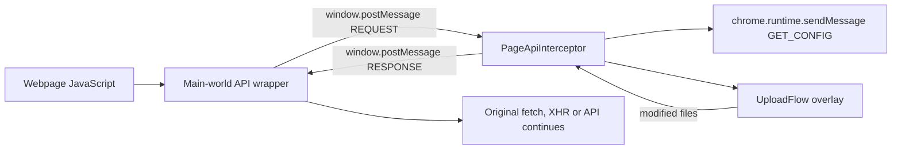
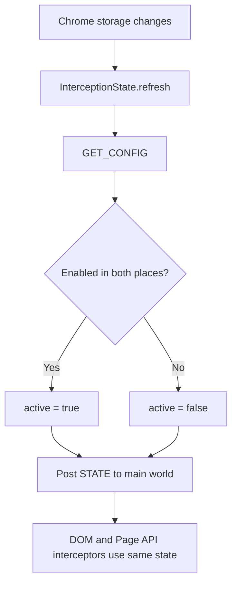

`PageApiInterceptor` and `InterceptionState` solve different problems from the standard input/drop/paste interceptors.

### Short explanation

- `FileInputInterceptor`, `DragDropInterceptor`, and `PasteInterceptor` handle normal DOM events.
- `PageApiInterceptor` handles files that bypass those DOM events, such as `fetch`, XHR, Clipboard API and File System Access API.
- `InterceptionState` keeps every interceptor synchronized with whether UploadFlow is currently enabled.

### Responsibility mapping

| Component | Responsibility |
|---|---|
| `FileInputInterceptor` | Captures trusted `<input type="file">` input events |
| `FileChangeInterceptor` | Blocks the native follow-up `change` event while input processing is pending |
| `DragDropInterceptor` | Captures files dropped onto the webpage |
| `PasteInterceptor` | Captures file-based paste events |
| `PageApiInterceptor` | Connects main-world API interception to the extension overlay |
| `InterceptionState` | Maintains and broadcasts the current enabled/disabled state |

## Why `PageApiInterceptor` exists

DOM interceptors only see browser events. Some websites upload files through JavaScript APIs instead:

```text
fetch(url, { body: formData })
XMLHttpRequest.send(formData)
navigator.clipboard.read()
FileSystemFileHandle.getFile()
```

The main-world script wraps these browser APIs because content scripts cannot safely replace page-owned JavaScript APIs from their isolated world.

When the main-world script finds a file, it sends:

```text
window.postMessage({
  type: "REQUEST",
  kind: "fetch-send",
  files
})
```

`PageApiInterceptor` receives that request in the content-script world, where Chrome extension APIs are available:



Therefore, `PageApiInterceptor` is the bridge between:

```text
Page world, where fetch/XHR can be wrapped
                ↕
Content-script world, where Chrome APIs and OverlayManager are available
```

It also handles main-world file-input interception. That overlaps with `FileInputInterceptor`, but the bypass markers and processed-file tracking prevent the returned event from being intercepted repeatedly.

## Why `InterceptionState` exists

`InterceptionState` provides a cached, live answer to:

```text
Is UploadFlow currently enabled?
```

During startup it requests the configuration:

```ts
GET_CONFIG
```

It combines:

```text
config.isEnabled
        AND
settings.generalSettings.enableUploadFlow
```

It then:

1. Stores the result in `active`.
2. Exposes it as `interceptionState.enabled`.
3. listens to `chrome.storage.onChanged`.
4. Broadcasts changes to the main-world script using `window.postMessage`.



Without `InterceptionState`:

- Input/drop/paste interceptors would need to request configuration for every event before deciding whether to intercept.
- The main-world script would not know when settings change.
- `fetch`, XHR, clipboard and file-handle wrappers could remain active after UploadFlow was disabled.
- There would be more asynchronous configuration checks and inconsistent behavior between interception paths.

So the clean explanation is:

> The DOM interceptors catch visible user actions. `PageApiInterceptor` catches programmatic file flows that do not rely on those actions. `InterceptionState` is the shared live switch that keeps both interception systems enabled or disabled together.